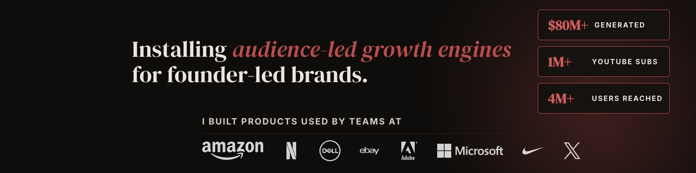

# topfold

> Design high-impact LinkedIn profile banners from scratch. A Claude Code skill.

**topfold** (n.) — the most valuable real estate on your LinkedIn profile: the banner behind your name. The thing everyone sees before they read a word about you.

This repo is a Claude Code skill that guides any user through a structured 5-phase process — from raw career material to a rendered, uploaded, display-tested banner — with 3 layout templates, a universal CSS design system, and battle-tested fixes for the most common pitfalls (photo overlap, display scale, upload failures, logo sizing).

Every rule, template, and fix in the skill corresponds to something that was actually tried, failed, and validated in a real ~3-hour iteration — not theory.

---

## What it does

Starting from scratch, the skill walks the user through:

1. **Proof mining** — extract the raw career material (numbers, brands, unique angles)
2. **Copy architecture** — assign each banner element one job, draft copy for each
3. **Visual design** — choose layout, collect brand assets, define palette
4. **Build & render** — source logos, generate HTML/CSS, render via Playwright
5. **Test & ship** — upload to LinkedIn, diagnose failures, iterate

Output: a **1584 × 396 JPG** (with embedded sRGB profile) ready to upload as a LinkedIn profile cover.

---

## Why this exists

Most LinkedIn banners are either generic or half-baked. Users hit these traps:

- **Designing for native resolution** (1584×396) when LinkedIn displays at ~50% scale → everything looks tiny
- **Underestimating the profile photo overlap** — the photo circle is wider at the bottom of the banner than at the top, so a single "safe zone" indent doesn't work
- **Weak social proof** — listing their own product logos instead of the household-name brands that USED what they built
- **Upload failures** — "Save failed" errors with no useful diagnostic info, usually caused by session/browser issues rather than the file
- **Iterating without structure** — tweaking fonts and colors forever without a framework for what to fix first

The skill encodes solutions to all of these as explicit rules, templates, and troubleshooting flows.

---

## Features

- **3 battle-tested layout templates** — Numbers Grid (media kit aesthetic), Story Arc (narrative-forward), Stacked Pills (balanced, recommended default)
- **Universal CSS design system** — 10 design tokens that work for any brand
- **Vertically-aware photo-safe zones** — 240px top / 340px middle / 400px bottom indents to clear the profile photo circle at its widest point
- **Asset sourcing cheat sheet** — pre-validated URLs for 28+ major brand logos (Simple Icons CDN + Wikimedia Commons fallbacks for trademark-protected brands)
- **Complete Playwright rendering pipeline** — local server, viewport screenshot, sRGB JPG export
- **Upload protocol** — mobile-first fallback order that actually works
- **15+ known-issue fixes** — every symptom→cause→fix pattern from the reference iteration
- **Critique framework** — 6 checkpoints for evaluating a live banner

---

## Requirements

### Required
- **Claude Code** (or another AI coding agent that supports Markdown skill files)
- **Python 3** with `Pillow` — `pip3 install Pillow` (used for sRGB export and logo background stripping)
- **Playwright MCP server** — used for the rendering pipeline. Install via [the official Playwright MCP integration](https://github.com/microsoft/playwright-mcp).

### Optional
- **Pillow's `ImageCms`** module (included by default with modern Pillow installs) for sRGB profile embedding
- **`sips`** (macOS built-in) or ImageMagick for dimension validation
- **`curl`** for downloading brand logos from CDN sources

---

## Installation

### Claude Code

```bash
cd ~/.claude/skills
git clone https://github.com/cmagnoletes/topfold.git
```

Claude Code will pick up the skill automatically — it reads `SKILL.md` from any folder inside `~/.claude/skills/`. The other files in the repo (`README.md`, `LICENSE`, `example-banner.jpg`) don't interfere.

The skill activates when the user says things like:

- "Build me a LinkedIn banner"
- "Design my LinkedIn cover"
- "Help me redesign my profile banner"
- "My LinkedIn banner looks bad, can you fix it?"

### Other AI coding agents

Copy `SKILL.md` into your agent's skills/tools directory. The YAML frontmatter declares the skill name and trigger description.

---

## Usage

Trigger the skill by asking for a banner:

```
> Build me a LinkedIn banner
> Design my topfold
> Help me redesign my profile banner
```

The skill will run through 5 phases, asking for your input at each step:

### Phase 1 — Proof Mining (~30 min)
Six questions to extract your career material:
1. Biggest financial number
2. Biggest audience number
3. Most recognizable brands/people you've worked with
4. Customer brands that USED what you built (← most important)
5. Your unique angle
6. Your positioning sentence

### Phase 2 — Copy Architecture (~15 min)
Map each banner element to a single job (positioning, proof, ownership, social proof, identity anchor), draft 2-3 options per element, lock in the final copy brief.

### Phase 3 — Visual Design (~30 min)
Share 5-8 reference banners you like, confirm brand palette/fonts/logos, pick a layout (Numbers Grid, Story Arc, or Stacked Pills).

### Phase 4 — Build & Render (~30 min per variant)
- Source customer brand logos from Simple Icons / Wikimedia
- Generate HTML from template + copy brief + brand tokens
- Render via Playwright (1584×396 viewport screenshot)
- Export JPG with embedded sRGB profile

### Phase 5 — Test & Ship (~15 min + iteration)
- Upload to LinkedIn (mobile app first — highest success rate)
- Critique the live render against 6 checkpoints
- Iterate on common fixes if needed

**Total time:** ~2 hours for a single variant, 3-4 hours for refinement-heavy work.

---

## Example output

Here's what the final "Stacked Pills" layout looks like (the recommended default):



Content breakdown:
- **Headline:** positioning sentence with an italicized accent phrase
- **Stats column (right side):** 3 pill components with big accent numbers + uppercase labels
- **Brand strip (bottom):** ownership claim ("I built products used by teams at") above a row of 8 customer brand logos
- **Background:** warm dark primary palette with subtle terracotta glow accents

---

## Layout templates at a glance

| Layout | Best for | Visual summary |
|---|---|---|
| **Numbers Grid** | Operators with 4+ crushing stats, media-kit aesthetic | 4 big stats in a row + tagline + brand strip |
| **Story Arc** | Trajectory stories, founders with a "from-to" journey | 3 stacked lines (past → transition → present) + brand strip |
| **Stacked Pills** ⭐ | Most users — balanced hero headline + proof column | Headline left + 3 pills on the right + brand strip at bottom |

---

## The content chain

Every element on a successful banner has exactly **one job**. Don't mix jobs between elements.

| Element | Job |
|---|---|
| Headline | Positioning (who you help + how) |
| Stats / Pills | Proof (scale/outcome numbers) |
| Brand strip label | Ownership / authorship claim |
| Brand logo strip | Social proof (who trusts your work) |
| Monogram / Logo | Identity anchor |
| Eyebrow text | Credential short form |

---

## Critical lessons baked into the skill

These are the 10 most important principles the skill encodes, extracted from the reference iteration:

1. **LinkedIn displays banners at ~50% scale.** Design 2x bigger than feels right.
2. **Profile photo circle is wider at the bottom than at the top.** Use vertically-aware photo-safe indents (240px top / 340px middle / 400px bottom), not a single constant.
3. **Customer brand strip > product logo strip.** "I built products used by teams at Amazon/Netflix/etc." is 10x stronger than listing your own product logos.
4. **Content chain rule:** one element = one job. Don't mix positioning, proof, ownership, and social proof.
5. **Upload protocol:** mobile app first, JPG first, incognito second, different browser third.
6. **sRGB profile embedding** is trivial (PIL + ImageCms) and prevents color shifts across devices.
7. **Iteration is the norm** — expect 4-6 rounds. First render is never the final.
8. **Dell, eBay, Nike, Microsoft logos always look small** — bump them 30-50% larger than other logos.
9. **Pills on dark surface background with brighter accent number** > pills on tinted-accent background with muted number. This is contrast, not preference.
10. **The diagnostic test** (solid-color PNG) isolates file vs session issues on upload failures.

---

## Asset sourcing

The skill includes pre-validated URLs for the most common customer brand logos:

**Simple Icons CDN** (works for most tech brands): Netflix, Dell, eBay, Nike, X, Meta, Spotify, Slack, GitHub, Airbnb, Uber, Shopify, HubSpot, Stripe, Notion, Figma, LinkedIn, Zoom

**Wikimedia Commons fallbacks** (for trademark-protected brands): Amazon, Adobe, Microsoft, Google, Apple, Coca-Cola, Tesla, Samsung, IBM, Oracle

Full URL list is in `SKILL.md` Section 8.

---

## Troubleshooting quick reference

| Symptom | Fix |
|---|---|
| LinkedIn "Save failed" on upload | Try mobile app, then incognito, then different browser. Run the diagnostic test image if all fail. |
| PNG fails but JPG works | Always export JPG as primary. LinkedIn's PNG handling is inconsistent. |
| Content covered by profile photo | Use vertically-aware indents (240/340/400), not a single constant |
| Text illegible at display scale | Bump all fonts ~50% larger (LinkedIn renders at ~50% native) |
| Nike/icon-style logos look tiny | Bump to 50px — the SVG viewBox has padding |
| Pill numbers low contrast | Change pill background to pure dark surface, number to `--accent-hi` |
| Content overflows banner edges | Use `grid-template-columns: minmax(0, 1fr) auto` |
| Pills not vertically centered | Use `justify-content: center`, not `space-between` |

Full table in `SKILL.md` Section 11.

---

## Output file layout

Running the skill produces:

```
{user-workspace}/topfold/
├── proof-stack.md                         # Phase 1 artifact
├── copy-brief.md                          # Phase 2 artifact
├── logos/                                 # Phase 4a sourced assets
│   ├── amazon.svg
│   ├── netflix.svg
│   └── ...
├── 2026-04-08_v1-numbers-grid.html        # Source
├── 2026-04-08_v1-numbers-grid.png         # PNG render
├── 2026-04-08_v1-numbers-grid.jpg         # JPG export (sRGB)
└── ...
```

All iterations are kept in the folder as a record of the process. Don't delete old versions — they're occasionally useful to revive.

---

## Limitations

This skill does **not**:
- Handle LinkedIn company page banners (different specs)
- Support animated or video banners (LinkedIn banners are static only)
- Run A/B tests on banner variants
- Track banner performance analytics (no LinkedIn API for banners exists)
- Replace your professional headshot or rewrite your About section

For those, use different tools or skills.

---

## Origin

This skill was extracted from a 3-hour collaborative session where an AI agent iteratively designed a LinkedIn banner for a high-credibility operator. The session went through 6+ visible refinement rounds covering:

- Proof mining across biography, CV, and career achievements
- Reference banner analysis (8 reference images)
- 3 initial layout variants (v1 → v3)
- Profile photo overlap troubleshooting
- Display scale legibility issues
- Upload failures and the mobile-first fallback
- Pill contrast problem (accent on tinted accent)
- Logo sourcing via Simple Icons + Wikimedia fallbacks
- Final design critique and polish

Every rule in the skill corresponds to something that was actually tried, failed, and fixed during that session. Nothing is theoretical.

---

## Contributing

Issues and pull requests welcome. If you find:

- A new brand logo source worth adding to the cheat sheet
- A new layout template that's genuinely different from the 3 included
- A troubleshooting pattern the skill doesn't cover
- A better photo-safe indent calculation for specific LinkedIn UI variants

...open a PR with the change and a brief description of the real-world case that motivated it.

---

## License

Apache License 2.0 — commercial use allowed, modification allowed, distribution allowed. See `LICENSE` for the full text.

---

## See also

- `SKILL.md` — the full skill file with all templates, CSS, and workflow details
- [LinkedIn Banner Size Specs](https://www.linkedin.com/help/linkedin/answer/a563608) — official LinkedIn guidance
- [Simple Icons](https://simpleicons.org/) — free brand logo CDN
- [Wikimedia Commons](https://commons.wikimedia.org/) — public domain logo source for trademarked brands
